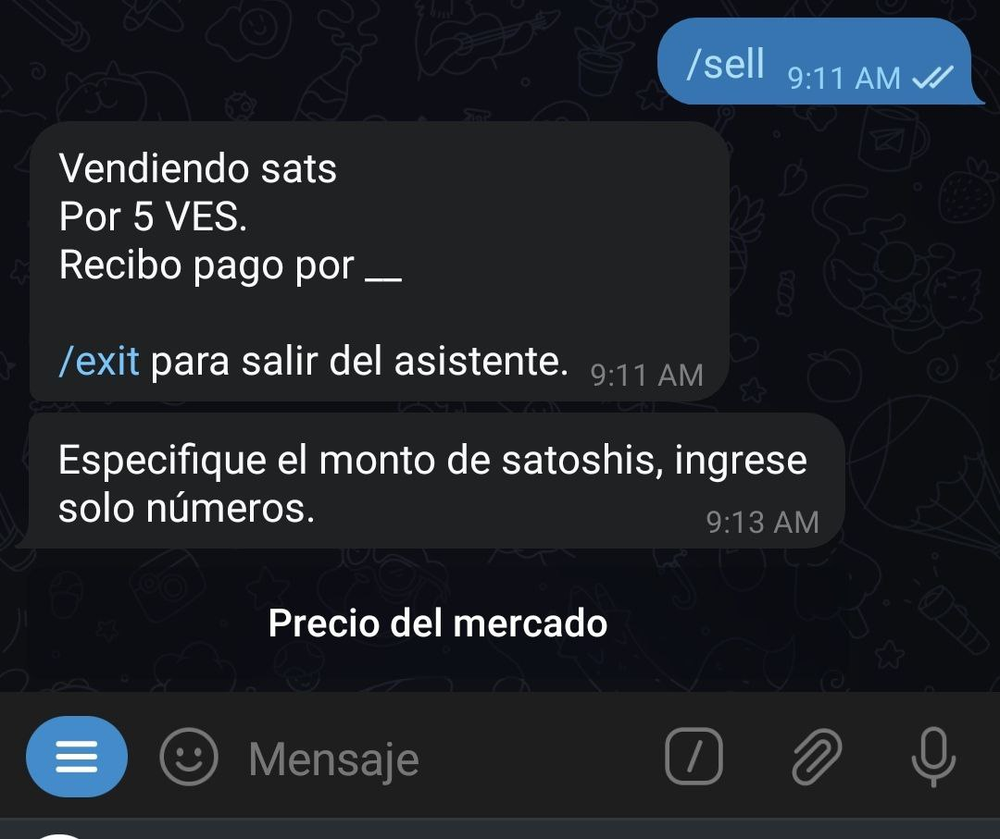

#  ¿Cómo creo una orden de venta?

Al conversar con [@lnp2pbot](https://t.me/lnp2pbot) encontrarás un botón de 'Menú'. Púlsalo para que se desplegue la lista de comandos que puedes usar. Selecciona el comando de venta: `/sell`. Este activará el asistente (*wizard*) que te guiará por el proceso de vender.

Una vez activado, el asistente te pedirá que especifiques la moneda fiat en la que quieres transar:

A continuación deberás introducir el monto, en moneda fiat, que quieres a cambio de tus satoshis. Recuerda ingresar solo números en este paso, para que el asistente te pueda entender.

También puedes introducir un rango de cantidades a comprar, separando los números por un guión (-).

El bot te preguntará el monto, en satoshis, que quieres entregar. Aquí tienes la posibilidad de usar el botón 'Precio del mercado'. Si lo haces, se aplicara la tasa de [Yadio.io](https://yadio.io/).

Lo siguiente que te solicita el asistente es el porcentaje de prima o descuento que quieres en tu intercambio. Si quieres aumentar la tasa de mercado (prima), selecciona un número positvo; si quieres disminuirla (descuento), selecciona un número negativo. En caso de no querer ninguna, usa el botón 'Sin prima ni descuento'.

A continuación, deberás especificar el método de pago. En este campo puedes ponerte creativo y añadir emoticones o lo que consideres para hacer atractiva tu solicitud.

El bot procederá a publicar tu oferta en el canal general o el de la comunidad que hayas configurado como predeterminada. Permanecerá visible por 23 horas, si nadie la toma antes de ese tiempo.

En cualquier momento puedes cancelar la oferta, siempre y cuando nadie la haya tomado, usando el comando `/cancel` seguido por el identificador de la orden. También puedes copiar el comando más el identificador en el chat con el bot.

El asistente te devolverá un mensaje confirmando la cancelación y se removerá tu oferta del canal de ofertas.

En caso de que tu venta sea tomada, el bot le pedirá a tu contraparte que entregue una factura Ligthning Network.

Al mismo tiempo, te pedirá que pagues la factura en con el monto en satoshis correspondiente, más una comisión del 0,6%. Recuerda que la red puede cobrarte un monto adicional por el enrutamiento del pago. Esa cantidad dependerá de los nodos por los que pasará tu transacción y el estado de la red. El bot no tiene que ver nada con ese monto.

En este momento el bot pondrá en contacto a ambas partes para que discutan los detalles del intercambio.

Una vez que el bot recibe el aviso de que el monto en fiat fue pagado, te envía un alerta para que revises tu cuenta. Si todo está en orden, puedes liberar los satoshis con el comando `/release` seguido del identificador de transaccion (o copia y pega el texto en el chat del bot) y se ejecutará la transacción.

El intercambio ha terminado. Ahora puedes calificar a tu contraparte.

Puedes salir del asistente en cualquier momento ejecutando el comando `/exit`.

Para ejecutar la misma orden de venta, sin usar el asistente, debes escribir tu orden con los detalles: `/sell <monto en sats> <monto en fiat> <código fiat> <método de pago> [prima/descuento]` (sin los carácteres especiales).

Ejemplo: `/sell 100000 50 usd "banco xyz"` Vendo cien mil sats a cincuenta dólares cobro por banco xyz

En caso de haber alguna variable no compatible el bot te lo indicará durante el proceso de creación de la orden. Al completarla, la misma se publicará en el canal de intercambio y será visible por un período de 23 horas.
